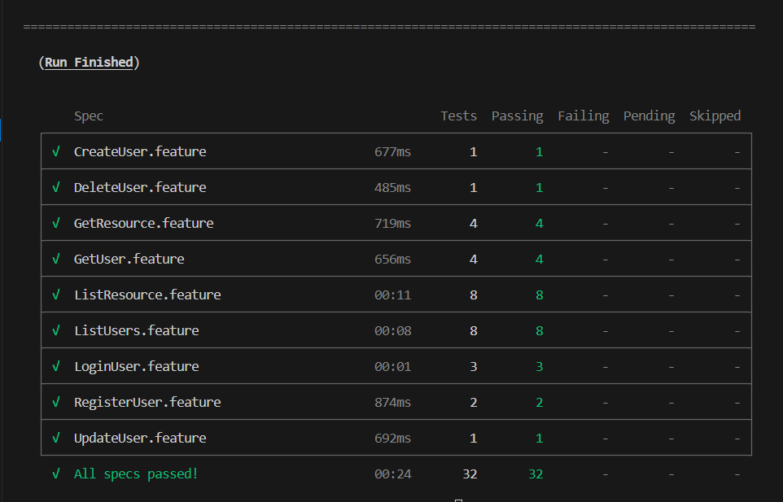

# ReqRes.in API Testing

E2E tests for https://reqres.in API

Tools used:

- Cypress
- Cucumber

## Quickstart

1. Run `npm install` to install dependencies.
2. Run `npx cypress run` to run all tests.

